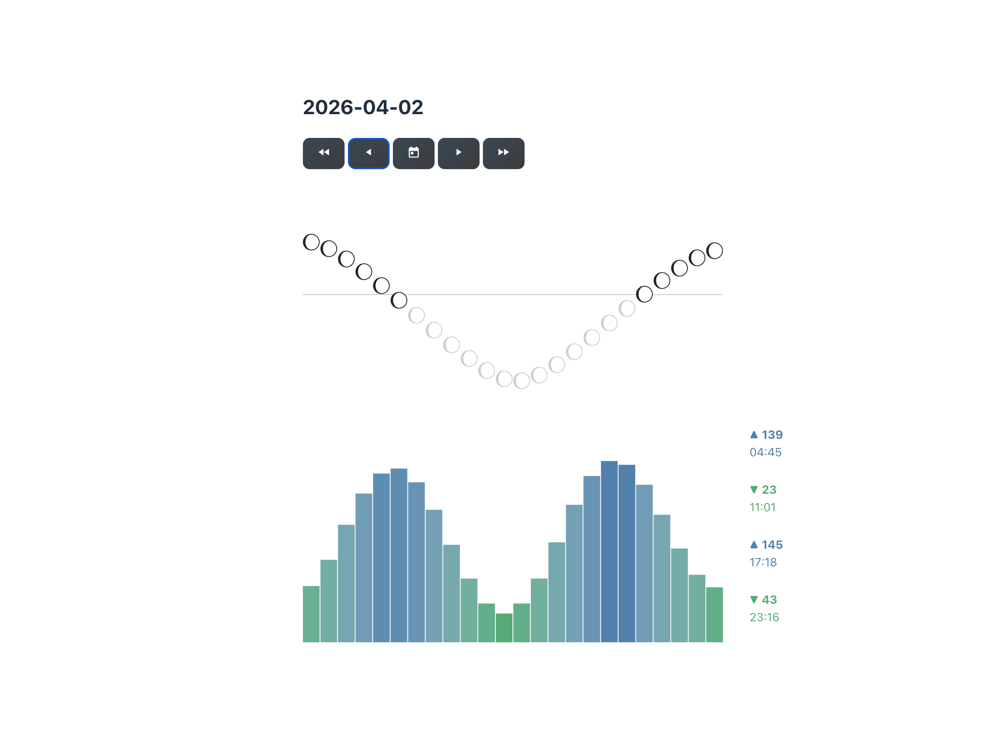

<p align="center">
	
</p>


# black-kite

Black-kite is a Preact + Vite app for viewing daily tide levels and moon position data. [[Demo](https://calbert1209.github.io/black-kite/)]

<p align="center">
  
</p>

## Requirements

- Node.js 18+ (20+ recommended)
- npm 9+


### Setup

1. install dependencies via `npm install` or `yarn install`
2. [Get NASA SVS Moon Info](#get-nasa-svs-moon-info).
3. generate the current year's data. See [Generate Annual Data](#generate-annual-data) below.
4. append the current year's data in the files `./public/lunar-data.json` and `./public/tidal-data.json`. See [Publish Data To Runtime Assets](#publish-data-to-runtime-assets) below.
5. run the dev serve via `npm run dev` or `yarn run dev`

### Get NASA SVS Moon Info

The 

How to get `mooninfo_<year>.json`:

A. Visit NASA's [Scientific Visualization Studio](https://svs.gsfc.nasa.gov/).

B. Search for `Moon Phase and Libration`.

C. Open the page for the year you want, for example `Moon Phase and Libration, 2026`.

D. On that yearly page, find the download link for the year's JSON data file.

E. Download the file and save it in `data/svs/` as `mooninfo_<year>.json`.

For example, the 2026 page exposes a JSON download for `mooninfo_2026.json`.

### Generate Annual Data

Use the npm script map for yearly data tasks:

```bash
# Generate all yearly artifacts in one command
npm run data:year -- <year>
```

Example:

```bash
npm run data:year -- 2026
```

### Publish Data To Runtime Assets

After generating a new year, merge that year into the runtime JSON assets:

- append/merge `data/main/<year>-lunar-data.json` into `public/lunar-data.json`
- append/merge `data/main/<year>-tidal-data.json` into `public/tidal-data.json`

Keep top-level keys in `YYYY-MM-DD` format and avoid duplicate date keys.

## Where Data Comes From

### 1. Lunar Position Data

Source systems:

- NASA JPL Horizons API (`ssd.jpl.nasa.gov/api/horizons.api`) for hourly ephemeris values.
- NASA Scientific Visualization Studio snapshots in `data/svs/mooninfo_<year>.json` for moon metadata.

How to get `mooninfo_<year>.json`:

1. Visit NASA's [Scientific Visualization Studio](https://svs.gsfc.nasa.gov/).
2. Search for `Moon Phase and Libration`.
3. Open the page for the year you want, for example `Moon Phase and Libration, 2026`.
4. On that yearly page, find the download link for the year's JSON data file.
5. Download the file and save it in `data/svs/` as `mooninfo_<year>.json`.

For example, the 2026 page exposes a JSON download for `mooninfo_2026.json`.

### 2. Tidal Data

Source system:

- Japan Meteorological Agency (JMA) tide text data (`www.data.jma.go.jp`).

Process:

- `scripts/createTidalDataFile.js` downloads yearly tidal data (`.../txt/<year>/D8.txt`).
- `scripts/jma/parse.js` parses rows into daily tidal events.
- output is written to `data/main/<year>-tidal-data.json`.

## Suggested Yearly Update Checklist

1. Ensure `data/svs/mooninfo_<year>.json` exists for the new year.
2. Run lunar and tidal generation scripts for that year.
3. Merge generated year data into `public/lunar-data.json` and `public/tidal-data.json`.
4. Run `npm run dev` and verify several dates across the new year.
5. Run `npm run build` to confirm production build integrity.

## Tech Stack

- Preact
- TypeScript
- Vite
- date-fns

